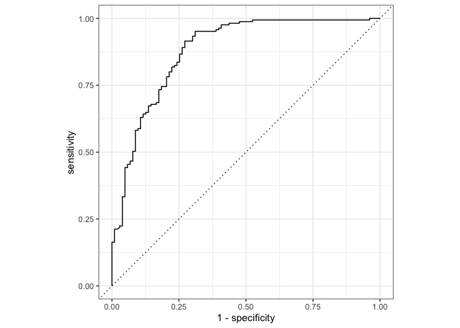

131_HW3
================
Zack Reardon

``` r
library(tidyverse)
library(tidymodels)
library(corrr)
library(discrim)
library(klaR)
library(poissonreg)
library(pROC)
tidymodels_prefer()

titanic <- read_csv("/Users/zackreardon/Downloads/homework-3/data/titanic.csv")

# converting to factors
titanic$survived <- as.factor(titanic$survived)
titanic$pclass <- as.factor(titanic$pclass)
```

Question 1.

``` r
set.seed(100)

titanic_split <- initial_split(titanic, prop = 0.70, strata = survived)

titanic_train <- training(titanic_split)
titanic_test <- testing(titanic_split)

tr <- nrow(titanic_train) # determine number of observations
tt <- nrow(titanic_test) # determine number of observations

print(tr/(tr+tt))
```

    ## [1] 0.6992144

``` r
titanic_train # look at training data
```

    ## # A tibble: 623 × 12
    ##    passenger_id survi…¹ pclass name  sex     age sib_sp parch ticket  fare cabin
    ##           <dbl> <fct>   <fct>  <chr> <chr> <dbl>  <dbl> <dbl> <chr>  <dbl> <chr>
    ##  1            1 No      3      Brau… male     22      1     0 A/5 2…  7.25 <NA> 
    ##  2            5 No      3      Alle… male     35      0     0 373450  8.05 <NA> 
    ##  3            6 No      3      Mora… male     NA      0     0 330877  8.46 <NA> 
    ##  4            7 No      1      McCa… male     54      0     0 17463  51.9  E46  
    ##  5           13 No      3      Saun… male     20      0     0 A/5. …  8.05 <NA> 
    ##  6           14 No      3      Ande… male     39      1     5 347082 31.3  <NA> 
    ##  7           17 No      3      Rice… male      2      4     1 382652 29.1  <NA> 
    ##  8           21 No      2      Fynn… male     35      0     0 239865 26    <NA> 
    ##  9           25 No      3      Pals… fema…     8      3     1 349909 21.1  <NA> 
    ## 10           27 No      3      Emir… male     NA      0     0 2631    7.22 <NA> 
    ## # … with 613 more rows, 1 more variable: embarked <chr>, and abbreviated
    ## #   variable name ¹​survived
    ## # ℹ Use `print(n = ...)` to see more rows, and `colnames()` to see all variable names

There appears to be some missing data regarding the age of some
passengers as well as the cabin number. It is a good idea to use
stratified sampling for this data since the purpose of the model is to
predict survival categorizations. By stratifying the data on the
survival variable, there exists a similar proportion of each
categorization in the training and testing sets which allows for a more
effective model.

Question 2.

``` r
ggplot(titanic_train, aes(x=survived)) + geom_bar()
```

<!-- -->

The distribution of the outcome variable in the training set indicates
that between 3/2 and double the amount of people who survived did not
survive.

Question 3.

``` r
cor_titanic <- titanic_train %>%
  select(is.numeric) %>%
  correlate()
```

    ## Warning: Predicate functions must be wrapped in `where()`.
    ## 
    ##   # Bad
    ##   data %>% select(is.numeric)
    ## 
    ##   # Good
    ##   data %>% select(where(is.numeric))
    ## 
    ## ℹ Please update your code.
    ## This message is displayed once per session.

    ## Correlation computed with
    ## • Method: 'pearson'
    ## • Missing treated using: 'pairwise.complete.obs'

``` r
rplot(cor_titanic)
```

<!-- -->

Age and siblings/spouses are negatively correlated as well as
parents/children and age. Parents/children and siblings/spouses, fare
and siblings/spouses, and fare and parents/children are positively
correlated.

Question 4.

``` r
titanic_recipe <- recipe(survived ~ pclass + sex + age + sib_sp + parch + fare, data = titanic_train) %>%
  step_impute_linear(age, impute_with = imp_vars(all_predictors())) %>%
  step_dummy(all_nominal_predictors()) %>%
  step_interact(~ starts_with("sex"):fare) %>%
  step_interact(~ age:fare)
```

Question 5.

``` r
log_reg <- logistic_reg() %>% 
  set_engine("glm") %>% 
  set_mode("classification")

log_wkflow <- workflow() %>% 
  add_model(log_reg) %>% 
  add_recipe(titanic_recipe)

log_fit <- fit(log_wkflow, titanic_train)
```

Question 6.

``` r
lda_mod <- discrim_linear() %>% 
  set_mode("classification") %>%
  set_engine("MASS")

lda_wkflow <- workflow() %>% 
  add_model(lda_mod) %>%
  add_recipe(titanic_recipe)

lda_fit <- fit(lda_wkflow, titanic_train)
```

Question 7.

``` r
qda_mod <- discrim_quad() %>% 
  set_mode("classification") %>% 
  set_engine("MASS")

qda_wkflow <- workflow() %>% 
  add_model(qda_mod) %>% 
  add_recipe(titanic_recipe)

qda_fit <- fit(qda_wkflow, titanic_train)
```

Question 8.

``` r
nb_mod <- naive_Bayes() %>% 
  set_mode("classification") %>% 
  set_engine("klaR") %>%
  set_args(usekernel = FALSE)

nb_wkflow <- workflow() %>% 
  add_model(nb_mod) %>% 
  add_recipe(titanic_recipe)

nb_fit <- fit(nb_wkflow, titanic_train)
```

Question 9.

``` r
log <- predict(log_fit, new_data = titanic_train, type = "prob")
lda <- predict(lda_fit, new_data = titanic_train, type = "prob")
qda <- predict(qda_fit, new_data = titanic_train, type = "prob")
nb <- predict(nb_fit, new_data = titanic_train, type = "prob")
bind_cols(log, lda, qda, nb, .name_repair="minimal")
```

    ## # A tibble: 623 × 8
    ##    .pred_No .pred_Yes .pred_No .pred_Yes .pred_No  .pred_Yes .pred_No .pred_Yes
    ##       <dbl>     <dbl>    <dbl>     <dbl>    <dbl>      <dbl>    <dbl>     <dbl>
    ##  1    0.900    0.100     0.935    0.0651    0.991 0.00922       0.974 0.0259   
    ##  2    0.913    0.0865    0.946    0.0538    0.994 0.00591       0.976 0.0236   
    ##  3    0.885    0.115     0.928    0.0719    0.992 0.00799       0.975 0.0248   
    ##  4    0.718    0.282     0.765    0.235     0.954 0.0458        0.687 0.313    
    ##  5    0.832    0.168     0.893    0.107     0.987 0.0127        0.973 0.0272   
    ##  6    0.967    0.0328    0.976    0.0236    1.00  0.000335      0.998 0.00177  
    ##  7    0.940    0.0604    0.953    0.0469    1.00  0.00000474    1.00  0.0000125
    ##  8    0.756    0.244     0.815    0.185     0.982 0.0183        0.760 0.240    
    ##  9    0.515    0.485     0.423    0.577     0.998 0.00175       0.982 0.0182   
    ## 10    0.886    0.114     0.928    0.0716    0.992 0.00785       0.975 0.0251   
    ## # … with 613 more rows
    ## # ℹ Use `print(n = ...)` to see more rows

``` r
log <- augment(log_fit, new_data = titanic_train) %>%
  accuracy(truth = survived, estimate = .pred_class)
lda <- augment(lda_fit, new_data = titanic_train) %>%
  accuracy(truth = survived, estimate = .pred_class)
qda <- augment(qda_fit, new_data = titanic_train) %>%
  accuracy(truth = survived, estimate = .pred_class)
nb <- augment(nb_fit, new_data = titanic_train) %>%
  accuracy(truth = survived, estimate = .pred_class)

accuracies <- c(log$.estimate, lda$.estimate, 
                qda$.estimate, nb$.estimate)
models <- c("Logistic Regression", "LDA", "QDA", "Naive Bayes")
results <- tibble(accuracies = accuracies, models = models)
results %>% 
  arrange(-accuracies)
```

    ## # A tibble: 4 × 2
    ##   accuracies models             
    ##        <dbl> <chr>              
    ## 1      0.806 Logistic Regression
    ## 2      0.801 LDA                
    ## 3      0.767 QDA                
    ## 4      0.767 Naive Bayes

The logistic regression had the highest accuracy on the training data.

Question 10.

``` r
predict(log_fit, new_data = titanic_test, type = "prob")
```

    ## # A tibble: 268 × 2
    ##    .pred_No .pred_Yes
    ##       <dbl>     <dbl>
    ##  1   0.0782    0.922 
    ##  2   0.904     0.0955
    ##  3   0.118     0.882 
    ##  4   0.205     0.795 
    ##  5   0.263     0.737 
    ##  6   0.747     0.253 
    ##  7   0.546     0.454 
    ##  8   0.272     0.728 
    ##  9   0.673     0.327 
    ## 10   0.388     0.612 
    ## # … with 258 more rows
    ## # ℹ Use `print(n = ...)` to see more rows

``` r
# report accuracy of model on testing data
augment(log_fit, new_data = titanic_test) %>%
  accuracy(truth = survived, estimate = .pred_class)
```

    ## # A tibble: 1 × 3
    ##   .metric  .estimator .estimate
    ##   <chr>    <chr>          <dbl>
    ## 1 accuracy binary         0.840

``` r
augment(log_fit, new_data = titanic_test) %>%
  conf_mat(truth = survived, estimate = .pred_class) %>%
  autoplot(type = "heatmap")
```

<!-- -->

``` r
augment(log_fit, new_data = titanic_test) %>%
  roc_curve(survived, .pred_Yes) %>%
  autoplot()
```

<!-- -->

``` r
# calculate AUC
```
